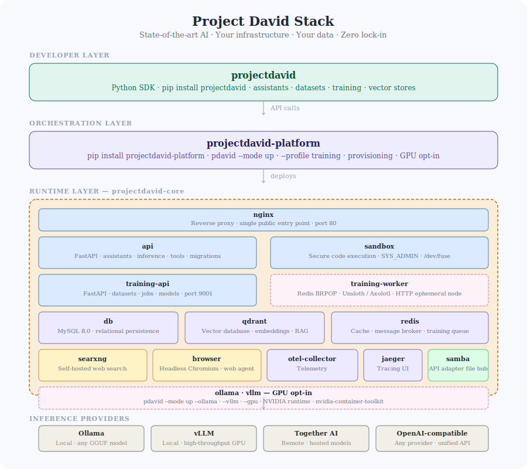

# Project David Platform

[](https://hub.docker.com/r/thanosprime/entities-api-api)
[](https://github.com/project-david-ai/platform-docker/actions/workflows/ci.yml)
[](https://pypi.org/project/projectdavid-platform/)
[](https://polyformproject.org/licenses/noncommercial/1.0.0/)

The projectdavid-platform API provides a simple, self-hosted interface for state-of-the-art AI — assistants, agents, RAG pipelines, and code execution — with full parity to the OpenAI Assistants API across heterogeneous inference providers.

Connect any model, anywhere. Run inference locally via Ollama or vLLM, or route to remote providers like Together AI — all through a single unified API. Switch providers without changing your application code.

**Your models. Your data. Your infrastructure. Zero lock-in.**

---

[](https://raw.githubusercontent.com/frankie336/entities_api/master/assets/projectdavid_logo.png)

---


## Installation

```bash
pip install projectdavid-platform
```

No repository clone required. The compose files and configuration templates are bundled with the package.

> **Windows users:** pip installs the `pdavid` command to a Scripts directory that is not on PATH by default. If `pdavid` is not found after installation, add the following to your PATH:
>
> ```
> C:\Users\<your-username>\AppData\Roaming\Python\Python3XX\Scripts
> ```
>
> Replace `Python3XX` with your Python version (e.g. `Python313`). On Linux and macOS this is handled automatically.

---

## Quick Start

This section walks you from a fresh install to your first streaming inference response.

### 1. Start the stack

```bash
pdavid --mode up
```

On first run this will generate a `.env` file with unique cryptographically secure secrets, prompt for optional values, pull all required Docker images, and start the full stack in detached mode.

To start with local GPU inference (Ollama or vLLM):

```bash
pdavid --mode up --ollama   # Ollama only
pdavid --mode up --vllm     # vLLM only
pdavid --mode up --gpu      # Both
```

Requires an NVIDIA GPU with the [NVIDIA Container Toolkit](https://docs.nvidia.com/datacenter/cloud-native/container-toolkit/install-guide.html) installed.

---

### 2. Bootstrap the admin user

```bash
pdavid bootstrap-admin
```

Expected output:

```
================================================================
  ✓  Admin API Key Generated
================================================================
  Email   : admin@example.com
  User ID : user_abc123...
  Prefix  : ad_abc12
----------------------------------------------------------------
  API KEY : ad_xxxxxxxxxxxxxxxxxxxxxxxxxxxxxxxxxxxxxxxxxxxxxxxx
----------------------------------------------------------------
  This key will NOT be shown again.
================================================================
```

> ⚠️ Store this key immediately. It is shown exactly once and cannot be recovered.

---

### 3. Create a user and API key

The admin key provisions users. Each user gets their own API key for SDK operations.

```python
import os
from projectdavid import Entity
from dotenv import load_dotenv
load_dotenv()

client = Entity(
    base_url=os.getenv("PROJECT_DAVID_PLATFORM_BASE_URL"),
    api_key=os.getenv("PROJECT_DAVID_PLATFORM_ADMIN_KEY"),
)

# Create a user
user = client.users.create_user(
    name="Sam Flynn",
    email="sam@encom.com",
)
print(user.id)

# Create an API key for that user
api_key = client.keys.create_key(user_id=user.id)
print(api_key)
```

Store `user.id` and the printed API key — you will need both for SDK operations.

---

### 4. Run your first inference

Install the SDK:

```bash
pip install projectdavid
```

> ⚠️ `projectdavid` is the developer SDK. `projectdavid-platform` is the deployment orchestrator. Do not confuse the two.

```python
import os
from projectdavid import Entity, ContentEvent, ReasoningEvent
from dotenv import load_dotenv
load_dotenv()

# Use the user key — not the admin key — for application operations.
client = Entity(
    base_url=os.getenv("PROJECT_DAVID_PLATFORM_BASE_URL"),
    api_key=os.getenv("PROJECT_DAVID_PLATFORM_USER_KEY"),
)

# Create an assistant
assistant = client.assistants.create_assistant(
    name="Test Assistant",
    model="DeepSeek-V3",
    instructions="You are a helpful AI assistant named Nexa.",
    tools=[
        {"type": "web_search"},
    ],
)

# Create a thread — threads maintain the full message state between turns
thread = client.threads.create_thread()

# Add a message to the thread
message = client.messages.create_message(
    thread_id=thread.id,
    assistant_id=assistant.id,
    content="Find me a positive news story from today.",
)

# Create a run
run = client.runs.create_run(
    assistant_id=assistant.id,
    thread_id=thread.id,
)

# Set up the inference stream — bring your own provider API key
stream = client.synchronous_inference_stream
stream.setup(
    thread_id=thread.id,
    assistant_id=assistant.id,
    message_id=message.id,
    run_id=run.id,
    api_key=os.getenv("HYPERBOLIC_API_KEY"),  # or TOGETHER_API_KEY etc.
)

# Stream the response
for event in stream.stream_events(model="hyperbolic/deepseek-ai/DeepSeek-V3"):
    if isinstance(event, ReasoningEvent):
        print(event.content, end="", flush=True)
    elif isinstance(event, ContentEvent):
        print(event.content, end="", flush=True)
```

**See the complete SDK reference [here](https://github.com/project-david-ai/projectdavid_docs/tree/master/src/pages/sdk).**

---

## Your Architecture

Do not use the platform API as your application backend directly. The intended design is a three-tier architecture:

- **projectdavid-platform** — inference orchestrator (this package)
- **Your backend** — business logic, auth, data
- **Your frontend** — user interface

See the [reference backend](https://github.com/project-david-ai/reference-backend) and [reference frontend](https://github.com/project-david-ai/reference-frontend) for starting points.

---

## Stack



| Service | Image | Description |
|---|---|---|
| `api` | `thanosprime/entities-api-api` | FastAPI backend exposing assistant and inference endpoints |
| `sandbox` | `thanosprime/entities-api-sandbox` | Secure code execution environment |
| `db` | `mysql:8.0` | Relational persistence |
| `qdrant` | `qdrant/qdrant` | Vector database for embeddings and RAG |
| `redis` | `redis:7` | Cache and message broker |
| `searxng` | `searxng/searxng` | Self-hosted web search |
| `browser` | `browserless/chromium` | Headless browser for web agent tooling |
| `otel-collector` | `otel/opentelemetry-collector-contrib` | Telemetry collection |
| `jaeger` | `jaegertracing/all-in-one` | Distributed tracing UI |
| `samba` | `dperson/samba` | File sharing for uploaded documents |
| `nginx` | `nginx:alpine` | Reverse proxy — single public entry point on port 80 |
| `ollama` | `ollama/ollama` | Local LLM inference (opt-in, `--ollama` or `--gpu`) |
| `vllm` | `vllm/vllm-openai` | High-throughput GPU inference (opt-in, `--vllm` or `--gpu`) |

---

## System Requirements

| Resource | Minimum | Notes |
|---|---|---|
| CPU | 4 cores | 8+ recommended |
| RAM | 16GB | 32GB+ if running vLLM |
| Disk | 50GB free | SSD recommended |
| GPU | — | Nvidia 8GB+ VRAM, optional, required only for vLLM / Ollama |

Runtime dependencies: Docker Engine 24+, Docker Compose v2+, Python 3.9+. `nvidia-container-toolkit` required only for GPU services.

---

## Lifecycle Commands

| Action | Command |
|---|---|
| Start the stack | `pdavid --mode up` |
| Start with Ollama | `pdavid --mode up --ollama` |
| Start with vLLM | `pdavid --mode up --vllm` |
| Start with both GPU services | `pdavid --mode up --gpu` |
| Pull latest images | `pdavid --mode up --pull` |
| Stop the stack | `pdavid --mode down_only` |
| Stop and remove all volumes | `pdavid --mode down_only --clear-volumes` |
| Force recreate containers | `pdavid --mode up --force-recreate` |
| Stream logs | `pdavid --mode logs --follow` |
| Destroy all stack data | `pdavid --nuke` |

Full CLI reference [here](https://github.com/project-david-ai/projectdavid_docs/blob/master/src/pages/projectdavid-platform/projectdavid-platform-commands.md).

---

## Configuration

```bash
pdavid configure --set HF_TOKEN=hf_abc123
pdavid configure --set VLLM_MODEL=Qwen/Qwen2.5-VL-7B-Instruct
pdavid configure --interactive
```

Rotating `MYSQL_PASSWORD`, `MYSQL_ROOT_PASSWORD`, or `SMBCLIENT_PASSWORD` on a live stack requires a full down and volume clear. The CLI will warn you.

---

## Upgrading

```bash
pip install --upgrade projectdavid-platform
pdavid --mode up --pull
```

After upgrading, `pdavid` will print a notice on the next run pointing to the changelog. Running `--pull` fetches the latest container images. Your data and secrets are not affected.

---

## Docker Images

- [thanosprime/entities-api-api](https://hub.docker.com/r/thanosprime/entities-api-api)
- [thanosprime/entities-api-sandbox](https://hub.docker.com/r/thanosprime/entities-api-sandbox)

Both images are published automatically on every release of the source repository.

---

## Related Repositories

| Repository | Purpose |
|---|---|
| [projectdavid-core](https://github.com/project-david-ai/projectdavid-core) | Source code for the platform runtime |
| [projectdavid](https://github.com/project-david-ai/projectdavid) | Python SDK — **start here for application development** |
| [reference-backend](https://github.com/project-david-ai/reference-backend) | Reference backend application |
| [reference-frontend](https://github.com/project-david-ai/reference-frontend) | Reference frontend application |

---

## Privacy

No data or telemetry leaves the stack except when you explicitly route to an external inference provider, your assistant calls web search at runtime, one of your tools calls an external API, or you load an image from an external URL.

Your instance is unique, with unique secrets. We cannot see your conversations, data, or secrets.

---

# Sovereign Forge — Training + Inference Mesh

Sovereign Forge is the opt-in training pipeline built into ProjectDavid. It turns
spare GPU hardware into a private fine-tuning and inference cluster — your data
stays on your machines, the models you train run on your hardware, and the
resulting endpoints are served through the same API surface as any other inference
provider in the stack.

## Requirements

- NVIDIA GPU with drivers installed
- [NVIDIA Container Toolkit](https://docs.nvidia.com/datacenter/cloud-native/container-toolkit/install-guide.html)
- Docker socket accessible at `/var/run/docker.sock`
- HuggingFace token for gated model downloads (optional but recommended)

## Starting the training stack

```bash
# Training pipeline + Ray cluster only
pdavid --mode up --training

# Training pipeline + static vLLM inference server
pdavid --mode up --training --vllm

# Full sovereign stack — Ollama + vLLM + training pipeline
pdavid --mode up --gpu --training
```

Adding `--training` to a running stack is safe. Docker Compose merges the overlay
and only starts the new services — existing containers are untouched.

## What gets added

| Service | Port | Purpose |
|---|---|---|
| `training-api` | `9001` | REST API for datasets, training jobs, and model registry |
| `training-worker` | — | GPU worker, Ray head node, DeploymentSupervisor actor |
| Ray dashboard | `8265` | Cluster visibility — http://localhost:8265 |
| Ray client | `10001` | External node join protocol |

The `training-worker` also spawns vLLM containers dynamically via the Docker SDK
when models are activated — this is independent of the static `--vllm` service.

## Configuration

On first run with `--training`, the orchestrator injects any missing variables
into your existing `.env` without touching secrets or other values:

```
TRAINING_PROFILE=laptop     # laptop | standard | high_end
RAY_ADDRESS=                # blank = head node; set to ray://<ip>:10001 to join
RAY_DASHBOARD_PORT=8265
```

Update them at any time:

```bash
pdavid configure --set TRAINING_PROFILE=standard
pdavid configure --set HF_TOKEN=hf_abc123
```

## Scaling out — adding a second GPU node

On any machine with a GPU and the NVIDIA Container Toolkit:

1. Set `RAY_ADDRESS=ray://<head_ip>:10001` in `.env`
2. Run:
   ```bash
   docker compose -f docker-compose.yml -f docker-compose.training.yml up -d training-worker
   ```

Ray discovers the node automatically. Cluster capacity increases immediately.
No code changes required.

## Activating a model for inference

Once the training stack is running, use the ProjectDavid SDK:

```python
import projectdavid as pd

client = pd.Client()

# Deploy a base model (single GPU)
client.models.activate_base("unsloth/qwen2.5-1.5b-instruct-unsloth-bnb-4bit")

# Deploy across multiple GPUs (tensor parallelism)
client.models.activate_base(
    "unsloth/Qwen2.5-7B-Instruct",
    tensor_parallel_size=4
)

# Deploy a fine-tuned LoRA adapter
client.models.activate("ftm_abc123")
```

The deployment is scheduled by Ray, the vLLM container is spawned dynamically,
and the InferenceResolver routes requests to the correct endpoint automatically.


---


## License

Distributed under the [PolyForm Noncommercial License 1.0.0](https://polyformproject.org/licenses/noncommercial/1.0.0/).
Commercial licensing is available on request.